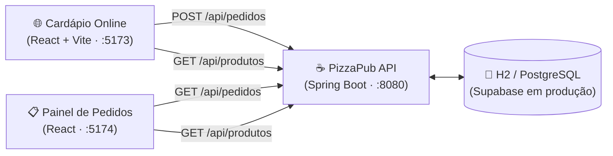
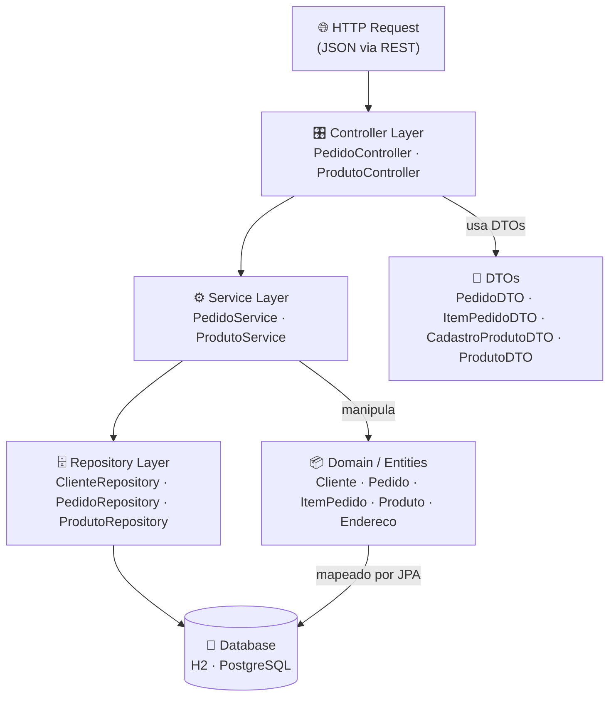
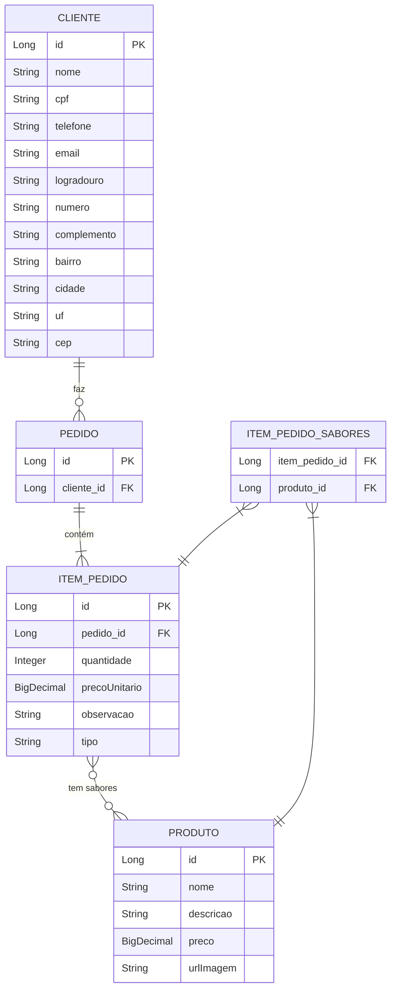
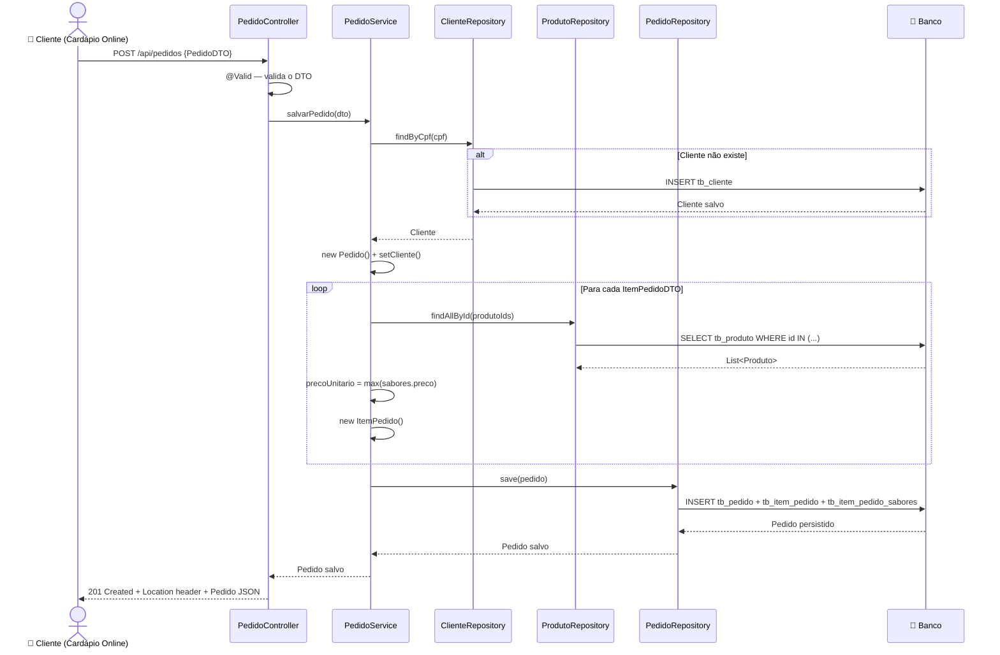
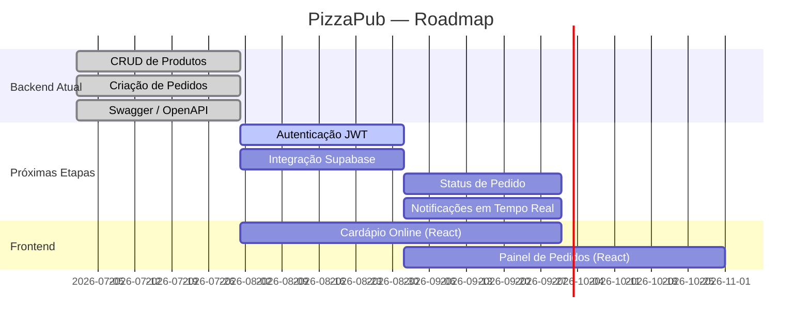

# 🏗️ Arquitetura — PizzaPub

Documento de arquitetura técnica do sistema PizzaPub. Descreve as camadas, relacionamentos de entidades, fluxo de dados e a visão de crescimento do projeto.

---

## 1. Visão Geral do Sistema

O PizzaPub é o **backend central** que une dois frontends:

- **Cardápio Online**: interface para o cliente montar e enviar seu pedido.
- **Painel de Pedidos**: tela interna usada pelos atendentes para acompanhar os pedidos em tempo real.



---

## 2. Arquitetura em Camadas

O backend segue o padrão **Layered Architecture** (arquitetura em camadas), onde cada camada tem uma responsabilidade única e só se comunica com a camada imediatamente abaixo.



### Responsabilidades por Camada

| Camada       | Pacote            | Responsabilidade                                                        |
|--------------|-------------------|-------------------------------------------------------------------------|
| Controller   | `controller/`     | Receber requisições HTTP, validar entrada com `@Valid`, retornar respostas REST |
| Service      | `service/`        | Aplicar regras de negócio, orquestrar repositórios, gerenciar transações |
| Repository   | `repository/`     | Acesso ao banco de dados via Spring Data JPA (CRUD automático)          |
| Domain       | `domain/`         | Entidades JPA que mapeiam as tabelas do banco de dados                  |
| DTOs         | `dtos/`           | Records Java para entrada/saída de dados — evitam exposição das entidades |
| Config       | `config/`         | Beans de configuração global (OpenAPI, segurança futura, CORS)          |

---

## 3. Diagrama de Entidades (ER)



> `Endereco` é um **Embeddable** — seus campos são armazenados diretamente na tabela `tb_cliente` (sem tabela própria).

---

## 4. Fluxo de Criação de Pedido

Passo a passo de um `POST /api/pedidos`:



---

## 5. Regras de Negócio Detalhadas

### 5.1 Precificação de Pizza Meio a Meio

Quando um `ItemPedido` contém **mais de um sabor** (ex: Calabresa + Quatro Queijos), o preço unitário é calculado como:

```
precoUnitario = max(sabor1.preco, sabor2.preco, ...)
```

Isso garante que o cliente pague sempre pelo sabor mais caro — prática padrão no mercado de pizzarias.

> Existe uma implementação alternativa comentada no código (`PedidoService`) que calcula a **média** dos preços. Pode ser ativada conforme decisão de negócio.

### 5.2 Criação Automática de Cliente

Ao criar um pedido, o sistema busca o cliente pelo **CPF**:

- **Encontrou**: usa o cliente existente.
- **Não encontrou**: cria um novo cliente com o CPF fornecido, sem dados adicionais (que podem ser preenchidos depois).

Isso evita que o cliente precise de um cadastro prévio para fazer um pedido.

### 5.3 Transacionalidade

O método `PedidoService.salvarPedido()` é anotado com `@Transactional`. Isso garante que:

- Todos os INSERTs (pedido, itens, sabores) ocorrem em uma única transação.
- Se qualquer etapa falhar (ex: sabor não encontrado), **nenhuma** alteração é persistida no banco.

---

## 6. Configuração do Ambiente

### 6.1 Desenvolvimento (Atual)

| Configuração    | Valor                                   |
|-----------------|-----------------------------------------|
| Banco de dados  | H2 em memória (`jdbc:h2:mem:pizzariadb`)|
| DDL             | `ddl-auto: update` (Hibernate gerencia) |
| Dados iniciais  | `data.sql` (7 pizzas pré-cadastradas)   |
| SQL no console  | `show-sql: true` + `format_sql: true`   |
| H2 Console      | `http://localhost:8080/h2-console`      |
| Swagger UI      | `http://localhost:8080/swagger-ui.html` |
| CORS liberado   | `http://localhost:5173` (React/Vite)    |

### 6.2 Produção (Planejado — Supabase)

| Configuração    | Valor                                           |
|-----------------|-------------------------------------------------|
| Banco de dados  | PostgreSQL no Supabase                          |
| DDL             | `ddl-auto: none` (migrations via Flyway)        |
| Dados iniciais  | Seeds controlados via Flyway                    |
| Storage         | Supabase Storage (imagens das pizzas)           |
| Autenticação    | JWT próprio ou Supabase Auth                    |

---

## 7. Roadmap de Funcionalidades



---

## 8. Decisões de Design (ADRs)

### ADR-001: Records Java como DTOs

**Decisão**: Usar `record` do Java para os DTOs em vez de classes com Lombok.

**Motivo**: Records são imutáveis por padrão, têm `equals()`, `hashCode()` e `toString()` gerados automaticamente, e são mais expressivos para objetos de transferência de dados read-only.

### ADR-002: Preço = Maior Sabor

**Decisão**: O preço de uma pizza meio a meio é o do sabor mais caro.

**Motivo**: Prática padrão no mercado. Simplifica o cálculo e evita disputas. A alternativa (média dos preços) está comentada no código para futura avaliação.

### ADR-003: Cliente criado on-the-fly

**Decisão**: Se o CPF do cliente não existir, um novo cadastro é criado automaticamente.

**Motivo**: Reduz atrito no pedido — o cliente não precisa se cadastrar previamente. O perfil completo pode ser enriquecido posteriormente.

### ADR-004: H2 em memória para desenvolvimento

**Decisão**: Usar banco H2 em memória no ambiente de desenvolvimento.

**Motivo**: Zero configuração, reinicia limpo a cada execução, facilita testes. Supabase (PostgreSQL) será usado em produção.
