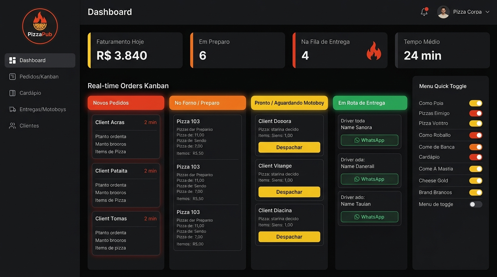
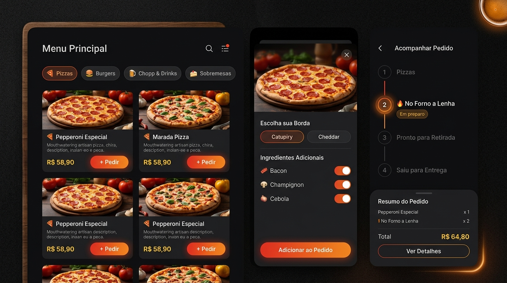

# 🍕 PizzaPub — Design System & Especificação Visual Completa

> **Conceito Estético:** *"Forno a Lenha, Brasa & Queijo Derretido"*  
> Identidade visual gastronômica para pub e pizzaria artesanal combinando Preto Carvão (`#0D0D0E`), Vermelho Fogo (`#E63B20`), Laranja Brasa (`#F27A1A`) e Amarelo Queijo Ouro (`#F5C518`).

---

## 1. 🖼️ Board do Design System


### 1.1 Paleta de Cores & Tokens de Marca

| Token | Cor | HEX | Função no Visual |
| :--- | :---: | :---: | :--- |
| `--color-brand-red` | 🔴 | `#E63B20` | **Vermelho Fogo / Molho:** Botões CTA primários (*Adicionar ao Pedido*, *Finalizar*), badge *"Novo"*, alertas e promoções |
| `--color-brand-red-dark` | 🍷 | `#B91C1C` | **Vermelho Forno:** Estado hover/ativo de botões principais, fundos de alerta |
| `--color-brand-orange` | 🟠 | `#F27A1A` | **Laranja Brasa:** Tabs de categoria ativas, foco de seleção, badge *"Em Preparo / Forno"*, gradientes |
| `--color-brand-orange-light`| 🥪 | `#FB923C` | **Laranja Crocante:** Hover secundário, badges de categoria, detalhes de ícones |
| `--color-brand-yellow` | 🟡 | `#F5C518` | **Amarelo Queijo Ouro:** Preços em destaque (`R$ 49,90`), estrelas de avaliação, badge *"Pronto para Retirada"* |
| `--color-brand-yellow-soft` | 🧈 | `#FEF08A` | **Amarelo Creme:** Glows quentes, destaques de texto |

### 1.2 Superfícies & Cores de Fundo (Dark Pub Experience)

| Token | HEX | Finalidade |
| :--- | :---: | :--- |
| `--bg-base` | `#0D0D0E` | **Preto Carvão Profundo:** Fundo imersivo que realça o colorido das pizzas e evita fadiga visual |
| `--bg-surface` | `#17181A` | **Grafite Pub:** Sidebars, Topbars e Navigation Bars |
| `--bg-card` | `#202226` | **Grafite Card:** Superfície dos cards de produtos, colunas Kanban e modais |
| `--bg-card-hover` | `#2A2D33` | **Card Elevado:** Destaque em hover e linhas ativas |
| `--border-subtle` | `rgba(255, 255, 255, 0.08)` | Bordas discretas para definição de profundidade |
| `--color-whatsapp` | `#25D366` | **Verde WhatsApp:** Contato direto e notificações |

---

## 2. 🖥️ Painel Gerencial, Cozinha & Fila de Entrega (`pizzapub-panel`)



### Funcionalidades do Painel Gerencial:
1. **Sidebar de Navegação:**
   - **Dashboard:** Visão geral e métricas do dia.
   - **Pedidos / Kanban:** Esteira em tempo real da cozinha.
   - **Cardápio:** Gerenciamento de itens, preços e fotos.
   - **Entregas / Motoboys:** Fila de despacho e rotas de entrega.
   - **Clientes:** Histórico de consumo e canal direto WhatsApp.

2. **KPI Cards no Topo:**
   - 🟡 **Faturamento Hoje:** `R$ 3.840` (destaque ouro).
   - 🟠 **Em Preparo:** `6` pedidos ativos no forno/bancada.
   - 🔴 **Na Fila de Entrega:** `4` pedidos aguardando despacho.
   - ⏱️ **Tempo Médio:** `24 min`.

3. **Kanban Real-time da Cozinha & Fila de Entrega:**
   - 🚨 **Novos Pedidos (Vermelho #E63B20):** Alerta sonoro/visual, cronômetro de tempo de espera e itens.
   - 🔥 **No Forno / Preparo (Laranja #F27A1A):** Detalhes da montagem e pizzas em andamento.
   - 🟡 **Pronto / Aguardando Motoboy (Amarelo #F5C518):** Botão direto **"Despachar"** para acionar o entregador.
   - 🟢 **Em Rota de Entrega (Verde #22C55E):** Nome do motoboy associado e botão com integração rápida via **WhatsApp**.

4. **Menu Quick Toggle:**
   - Liga/desliga produtos em tempo real caso acabe um ingrediente no estoque.

---

## 3. 📱 Cardápio Digital, Customização & Rastreamento (`pizzapub-menu`)



### Funcionalidades da Área do Cliente:
1. **Menu Principal & Categorias:**
   - Filtros em formato de pílulas: 🍕 **Pizzas** | 🍔 **Burgers** | 🍺 **Chopp & Drinks** | 🍰 **Sobremesas**.
   - Grid com fotos apetitosas, descrições claras, preço em destaque amarelo ouro (`R$ 58,90`) e botão de ação rápida `+ Pedir`.

2. **Modal / Gaveta de Customização:**
   - Escolha do tipo de borda recheada (*Catupiry*, *Cheddar*).
   - Toggles de ingredientes adicionais (*Bacon crocante*, *Champignon fresco*, *Cebola caramelizada*).
   - Botão de confirmação com gradiente de fogo `Adicionar ao Pedido`.

3. **Rastreamento em Tempo Real (Order Tracking):**
   - Timeline vertical sincronizada com o painel da cozinha:
     1. Pedido Recebido
     2. 🔥 **No Forno a Lenha (Em preparo — etapa ativa com glow pulsante)**
     3. Pronto para Retirada
     4. Saiu para Entrega
   - Resumo do pedido com valor total em destaque e botão para ver detalhes.

---

## 💻 4. Configuração Pronta para Tailwind CSS

```javascript
// tailwind.config.js
module.exports = {
  darkMode: 'class',
  content: ['./index.html', './src/**/*.{js,ts,jsx,tsx}'],
  theme: {
    extend: {
      colors: {
        pub: {
          bg: '#0D0D0E',
          surface: '#17181A',
          card: '#202226',
          'card-hover': '#2A2D33',
          border: 'rgba(255, 255, 255, 0.08)',
        },
        brand: {
          red: '#E63B20',
          'red-dark': '#B91C1C',
          orange: '#F27A1A',
          'orange-light': '#FB923C',
          yellow: '#F5C518',
          'yellow-light': '#FEF08A',
        },
        status: {
          novo: '#E63B20',
          preparo: '#F27A1A',
          pronto: '#F5C518',
          entregue: '#22C55E',
        }
      },
      backgroundImage: {
        'flame-gradient': 'linear-gradient(135deg, #E63B20 0%, #F27A1A 100%)',
        'amber-gradient': 'linear-gradient(135deg, #F27A1A 0%, #F5C518 100%)',
        'dark-card-gradient': 'linear-gradient(180deg, #25282F 0%, #17181A 100%)',
      },
      boxShadow: {
        'flame': '0 4px 20px -2px rgba(230, 59, 32, 0.45)',
        'amber': '0 4px 20px -2px rgba(242, 122, 26, 0.35)',
        'card': '0 10px 25px -5px rgba(0, 0, 0, 0.5), 0 8px 10px -6px rgba(0, 0, 0, 0.5)',
      },
      borderRadius: {
        'card': '16px',
        'button': '12px',
        'chip': '9999px',
      }
    },
  },
  plugins: [],
}
```
