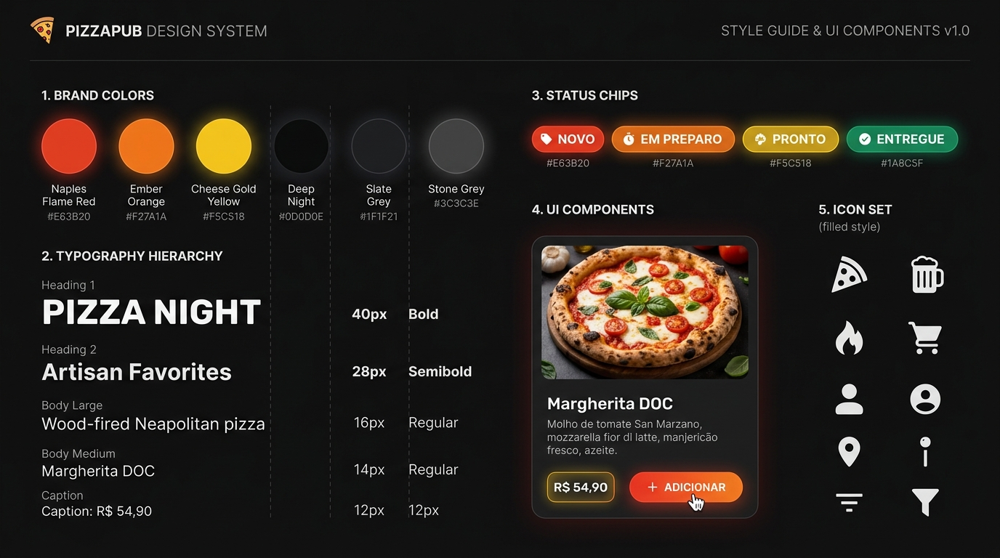

# 🍕 PizzaPub — Design System & Guia Visual



> **Conceito Visual:** *"Forno a Lenha, Brasa & Queijo Derretido"*  
> Uma experiência visual moderna, apetitosa e imersiva inspirada na atmosfera acolhedora de pubs artesanais e pizzarias contemporâneas. Combina tons escuros profundos (Carvão e Grafite) com uma explosão energética e quente de **Vermelho Molho/Fogo**, **Laranja Brasa** e **Amarelo Queijo/Ouro**.

---

## 🎨 1. Paleta de Cores & Tokens

### 1.1 Cores Principais da Marca (Quentes & Apetitosas)

| Token | Nome | Hex | Amostra | Aplicação Principal |
| :--- | :--- | :--- | :---: | :--- |
| `--color-brand-red` | **Vermelho Nápoles** | `#E63B20` | 🔴 | Botões de conversão primários, CTAs principais, promoções urgentes, status "Novo" |
| `--color-brand-red-dark`| **Vermelho Forno** | `#B91C1C` | 🍷 | Hover de botões primários, gradientes de profundidade |
| `--color-brand-orange` | **Laranja Brasa** | `#F27A1A` | 🟠 | Destaques secundários, foco de inputs, badges "Em Preparo", gradientes |
| `--color-brand-orange-light`| **Laranja Crocante**| `#FB923C` | 🥪 | Hover de secundários, chips de categoria ativos, tags especiais |
| `--color-brand-yellow` | **Amarelo Queijo Ouro**| `#F5C518` | 🟡 | Preços de destaque, avaliações (estrelas), badges "Pronto/Retirada", avisos |
| `--color-brand-yellow-soft`| **Amarelo Creme** | `#FEF08A` | 🧈 | Glows sutis, textos de destaque em fundo escuro |

---

### 1.2 Superfícies & Cores de Fundo (Dark Pub Theme)

| Token | Nome | Hex | Descrição |
| :--- | :--- | :--- | :--- |
| `--bg-base` | **Preto Carvão Profundo** | `#0D0D0E` | Fundo principal da aplicação (reduz cansaço visual e valoriza as fotos) |
| `--bg-surface` | **Grafite Pub** | `#17181A` | Fundo de containers, header, sidebar |
| `--bg-card` | **Card Escuro** | `#202226` | Cards de produtos, colunas kanban, modais |
| `--bg-card-hover` | **Card Destacado** | `#2A2D33` | Hover de itens interativos e linhas de tabela |
| `--bg-glass` | **Vidro Escuro Fume** | `rgba(23, 24, 26, 0.85)` | Floating Cart Bar, headers sticky com `backdrop-blur-md` |

---

### 1.3 Tipografia & Cores de Texto

| Token | Nome | Hex | Uso |
| :--- | :--- | :--- | :--- |
| `--text-primary` | **Branco Puro** | `#FFFFFF` | Títulos, nomes de produtos, números de pedidos |
| `--text-secondary`| **Cinza Prata** | `#D1D5DB` | Descrições curtas, subtítulos, textos de apoio |
| `--text-muted` | **Cinza Chumbo** | `#9CA3AF` | Labels auxiliares, timestamps, placeholders |
| `--text-accent` | **Dourado Queijo** | `#F5C518` | Valores monetários (`R$ 49,90`), descontos |

---

### 1.4 Status do Fluxo da Cozinha & Pedidos

| Status | Badge / Token | Hex | Significado Visual |
| :--- | :--- | :--- | :--- |
| **Novo** | `--status-novo` | `#E63B20` (Vermelho) | 🚨 Pedido acabou de cair na esteira (alta atenção) |
| **Em Preparo** | `--status-preparo` | `#F27A1A` (Laranja) | 🔥 No forno / bancada de montagem |
| **Pronto / Saiu**| `--status-pronto` | `#F5C518` (Amarelo) | 📦 Pronto para retirada no balcão ou com entregador |
| **Entregue** | `--status-entregue`| `#22C55E` (Verde) | ✅ Finalizado com sucesso |
| **WhatsApp** | `--color-whatsapp` | `#25D366` (Verde Zap)| 💬 Ação direta de conversa com cliente |

---

### 1.5 Gradientes de Assinatura

```css
/* Gradiente Flame (Logo, CTA Principal, Destaques) */
--gradient-flame: linear-gradient(135deg, #E63B20 0%, #F27A1A 100%);

/* Gradiente Sunset Brasa (Preços especiais, banners promocionais) */
--gradient-amber: linear-gradient(135deg, #F27A1A 0%, #F5C518 100%);

/* Gradiente Carvão (Cards de alta sofisticação) */
--gradient-dark: linear-gradient(180deg, #25282F 0%, #17181A 100%);

/* Glow Quente de Fundo (Efeito Forno) */
--glow-flame: 0 0 25px rgba(230, 59, 32, 0.35);
--glow-amber: 0 0 20px rgba(242, 122, 26, 0.30);
--glow-gold: 0 0 15px rgba(245, 197, 24, 0.25);
```

---

## 📐 2. Tipografia & Escala Modular

- **Fonte Display / Títulos:** `'Plus Jakarta Sans'`, `'Inter'` ou `'Montserrat'`, com peso **Extra Bold (800)** para títulos com presença marcante.
- **Fonte do Corpo & Dados:** `'Inter'`, `'system-ui'`, `-apple-system`, com pesos **Regular (400)**, **Medium (500)** e **SemiBold (600)**.

| Nível | Tamanho | Peso | Line-Height | Uso |
| :--- | :--- | :--- | :--- | :--- |
| **Display / Hero** | `2.25rem` (36px) | 800 (Extrabold) | 1.15 | Slogan, Banner do Cardápio |
| **H1** | `1.75rem` (28px) | 700 (Bold) | 1.25 | Títulos de Seção, Nome da Categoria |
| **H2 / Card Title**| `1.25rem` (20px) | 600 (Semibold) | 1.30 | Nome da Pizza / Produto |
| **Price Hero** | `1.375rem` (22px)| 800 (Extrabold) | 1.0 | Preço em destaque dourado |
| **Body Large** | `1.0rem` (16px) | 400 (Regular) | 1.50 | Texto principal |
| **Body Small** | `0.875rem` (14px)| 400 (Regular) | 1.40 | Descrições dos ingredientes, observações |
| **Caption / Badge**| `0.75rem` (12px) | 700 (Bold) | 1.0 | Status, Tags de categoria, chips de filtro |

---

## 🧱 3. Componentes Visuais Chave

### 3.1 Botões de Ação (Buttons & CTAs)

1. **Botão Primário "Fogo" (Adicionar ao Carrinho, Finalizar Pedido)**
   - Fundo: `linear-gradient(135deg, #E63B20, #F27A1A)`
   - Texto: `#FFFFFF`, peso `700`
   - Borda: Nenhuma (com sombra `box-shadow: 0 4px 14px rgba(230, 59, 32, 0.35)`)
   - Efeito Hover: Escala `1.02` e brilho reforçado.

2. **Botão Secundário "Brasa" (Editar, Ações de Apoio)**
   - Fundo: `rgba(242, 122, 26, 0.15)`
   - Borda: `1px solid rgba(242, 122, 26, 0.5)`
   - Texto: `#F27A1A`, peso `600`
   - Efeito Hover: Fundo preenchido com `#F27A1A` e texto `#FFFFFF`.

3. **Botão WhatsApp Instantâneo**
   - Fundo: `linear-gradient(135deg, #22C55E, #16A34A)`
   - Texto: `#FFFFFF`
   - Ícone: Logo oficial WhatsApp

4. **Botão de Adicionar Rápido ("+" Circular no Card)**
   - Círculo de `36px x 36px`
   - Fundo: Gradiente Vermelho-Laranja
   - Ícone: `+` branco em bold

---

### 3.2 Cards de Produtos (Cardápio Digital)

- **Fundo:** `#202226` com borda sutil de `1px solid rgba(255, 255, 255, 0.06)`
- **Border-Radius:** `16px` (`rounded-2xl`)
- **Foto:** Recipiente com imagem apetitosa recortada ou circular com leve sombra
- **Badge de Destaque:** Tag no topo "🔥 Mais Pedida" com fundo `#E63B20` e texto branco
- **Preço:** `#F5C518` (Amarelo Queijo) em `1.25rem` extra-bold
- **Micro-interação:** Ao passar o mouse, a borda ganha leve tom alaranjado (`rgba(242, 122, 26, 0.4)`) e o card eleva `translate-y: -2px`.

---

### 3.3 Barra de Navegação por Categorias (Tabs)

- Categorias: 🍕 **Pizzas** | 🍔 **Lanches** | 🥤 **Bebidas** | 🍰 **Sobremesas**
- **Tab Selecionada:**
  - Fundo: `linear-gradient(135deg, #E63B20, #F27A1A)`
  - Texto: `#FFFFFF` com sombra sutil
  - Border-Radius: `9999px` (Pill format)
- **Tab Inativa:**
  - Fundo: `#17181A` com borda `1px solid #2A2D33`
  - Texto: `#9CA3AF`

---

### 3.4 Kanban da Cozinha (Painel Admin)

- **Coluna "🚨 Novo":** Borda superior vermelha `#E63B20` (4px), contador em badge vermelho pulsante.
- **Coluna "🔥 Em Preparo":** Borda superior laranja `#F27A1A` (4px), timer em andamento.
- **Coluna "🟡 Pronto / Balcão":** Borda superior dourada `#F5C518` (4px), botão rápido "Despachar / Chamar no WhatsApp".
- **Coluna "✅ Entregue":** Borda verde discreta `#22C55E`.

---

## 💻 4. Configuração Pronta para Tailwind CSS

Para aplicar diretamente em `pizzapub-menu` e `pizzapub-panel`:

```javascript
// tailwind.config.js
module.exports = {
  darkMode: 'class',
  content: ['./index.html', './src/**/*.{js,ts,jsx,tsx}'],
  theme: {
    extend: {
      colors: {
        pub: {
          bg: '#0D0D0E',
          surface: '#17181A',
          card: '#202226',
          'card-hover': '#2A2D33',
          border: 'rgba(255, 255, 255, 0.08)',
        },
        brand: {
          red: '#E63B20',
          'red-dark': '#B91C1C',
          orange: '#F27A1A',
          'orange-light': '#FB923C',
          yellow: '#F5C518',
          'yellow-light': '#FEF08A',
        },
        status: {
          novo: '#E63B20',
          preparo: '#F27A1A',
          pronto: '#F5C518',
          entregue: '#22C55E',
        }
      },
      backgroundImage: {
        'flame-gradient': 'linear-gradient(135deg, #E63B20 0%, #F27A1A 100%)',
        'amber-gradient': 'linear-gradient(135deg, #F27A1A 0%, #F5C518 100%)',
        'dark-card-gradient': 'linear-gradient(180deg, #25282F 0%, #17181A 100%)',
      },
      boxShadow: {
        'flame': '0 4px 20px -2px rgba(230, 59, 32, 0.45)',
        'amber': '0 4px 20px -2px rgba(242, 122, 26, 0.35)',
        'card': '0 10px 25px -5px rgba(0, 0, 0, 0.5), 0 8px 10px -6px rgba(0, 0, 0, 0.5)',
      },
      borderRadius: {
        'card': '16px',
        'button': '12px',
        'chip': '9999px',
      }
    },
  },
  plugins: [],
}
```

---

## 🎨 5. Variáveis CSS Globais (`tokens.css`)

```css
:root {
  /* Cores Quentes */
  --color-flame-red: #E63B20;
  --color-flame-red-hover: #CC2F17;
  --color-ember-orange: #F27A1A;
  --color-cheese-gold: #F5C518;
  --color-whatsapp: #25D366;

  /* Superfícies Dark */
  --bg-app: #0D0D0E;
  --bg-surface: #17181A;
  --bg-card: #202226;
  --bg-card-hover: #2A2D33;
  --border-subtle: rgba(255, 255, 255, 0.08);
  --border-focus: #F27A1A;

  /* Tipografia */
  --text-white: #FFFFFF;
  --text-silver: #D1D5DB;
  --text-gray: #9CA3AF;
  --text-gold: #F5C518;

  /* Gradientes & Efeitos */
  --grad-primary: linear-gradient(135deg, #E63B20 0%, #F27A1A 100%);
  --grad-warm: linear-gradient(135deg, #F27A1A 0%, #F5C518 100%);
  --shadow-glow: 0 4px 18px rgba(230, 59, 32, 0.35);
  
  /* Raios de borda */
  --radius-sm: 8px;
  --radius-md: 12px;
  --radius-lg: 16px;
  --radius-full: 9999px;
}
```

---

## 📱 6. Exemplos de Componentes Visuais Prontos (JSX / HTML)

### Exemplo 1: Card de Pizza Apetitoso
```html
<div class="relative bg-pub-card border border-pub-border rounded-card p-4 hover:border-brand-orange/40 hover:-translate-y-1 transition-all duration-300 shadow-card group">
  <!-- Badge Promoção / Tag -->
  <span class="absolute top-3 left-3 bg-brand-red text-white text-[11px] font-bold px-2.5 py-1 rounded-full uppercase tracking-wider shadow-sm">
    🔥 Mais Pedida
  </span>

  <!-- Imagem com brilho suave -->
  <div class="w-full h-40 rounded-xl overflow-hidden mb-3 bg-pub-surface flex items-center justify-center">
    
  </div>

  <!-- Informações -->
  <h3 class="text-white font-bold text-lg mb-1 group-hover:text-brand-orange-light transition-colors">
    Calabresa Defumada Artesanal
  </h3>
  <p class="text-pub-border/70 text-gray-400 text-xs line-clamp-2 mb-4">
    Molho de tomate pelado, mozzarella fior di latte, fatias finas de calabresa artesanal e orégano fresco.
  </p>

  <!-- Rodapé do Card: Preço e Botão Adicionar -->
  <div class="flex items-center justify-between pt-2 border-t border-pub-border/50">
    <div>
      <span class="text-[10px] uppercase tracking-wider text-gray-400 block">A partir de</span>
      <span class="text-brand-yellow font-black text-xl">R$ 54,90</span>
    </div>
    
    <button class="bg-flame-gradient hover:opacity-90 text-white font-bold p-2.5 rounded-button shadow-flame active:scale-95 transition-all flex items-center gap-1.5 text-sm">
      <span>+</span>
      <span>Adicionar</span>
    </button>
  </div>
</div>
```

---

### Exemplo 2: Floating Cart Bar (Cardápio Mobile)
```html
<div class="fixed bottom-4 left-4 right-4 z-50">
  <div class="bg-pub-surface/90 backdrop-blur-md border border-brand-orange/30 p-3.5 rounded-2xl shadow-flame flex items-center justify-between">
    <div class="flex items-center gap-3">
      <div class="bg-flame-gradient text-white font-bold w-10 h-10 rounded-xl flex items-center justify-center text-lg shadow-sm">
        🛒
      </div>
      <div>
        <p class="text-xs text-gray-400">3 itens no pedido</p>
        <p class="text-brand-yellow font-black text-base">R$ 119,70</p>
      </div>
    </div>

    <button class="bg-flame-gradient hover:opacity-95 text-white font-bold px-5 py-2.5 rounded-xl shadow-flame active:scale-95 transition-all text-sm flex items-center gap-2">
      <span>Ver Sacola</span>
      <span>→</span>
    </button>
  </div>
</div>
```
